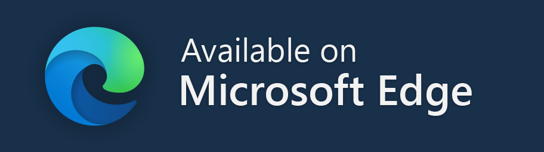

<h1 align="center">
    
        
    
    FreeServer
</h1>

---

## FAQ

#### What does this plugin do?

This plugin can provide you free robux vip server

#### Why it doesn't display any free vip server?

If the plugin can't get any vip server from the provide server, it will not display anything.
